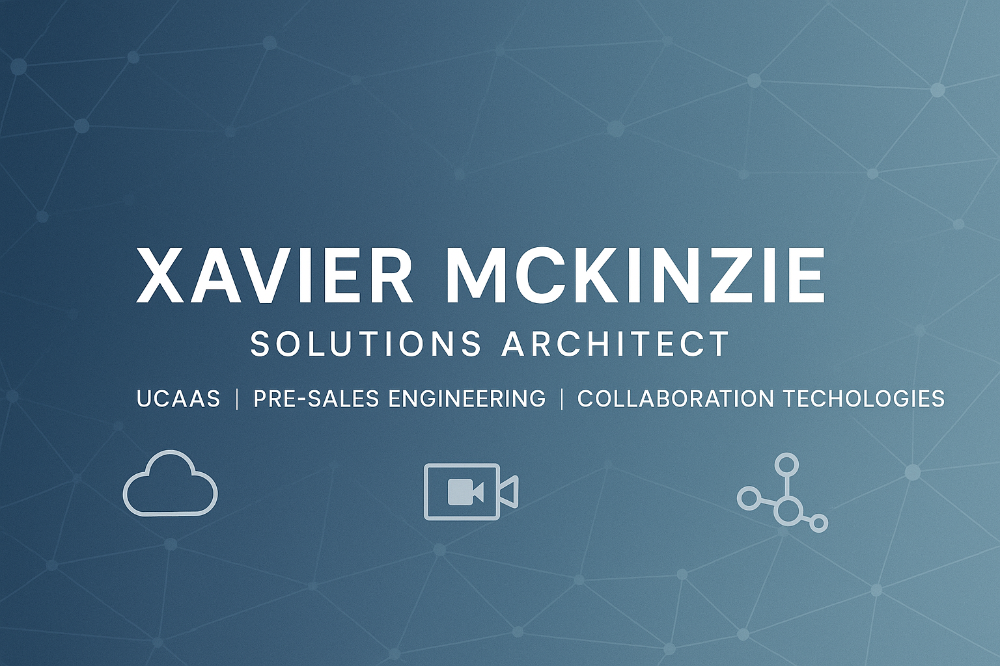

# Hi, I’m Xavier 👋  

**Solutions Architect | Pre-Sales Engineering | Collaboration Technologies**  

I help organizations modernize their UCaaS/CCaaS platforms and enterprise collaboration environments. With **17+ years in networking** and **8+ years leading enterprise collaboration deployments**, I bridge the gap between technical architectures and business outcomes.  

---

## 🚀 What I Do
- Architect **Cisco Webex, Microsoft Teams Rooms, and hybrid collaboration** solutions  
- Partner with sales to align **technical roadmaps with executive priorities**  
- Build **automation tools and reporting dashboards** that simplify UCaaS/CCaaS adoption  
- Contribute to **customer success** from discovery → design → deployment  

---

## 📈 Impact Highlights
- Influenced **$4.5M+ closed-won collaboration revenue** since 2022  
- Guided **47+ enterprise deals** from $20K to $1M+  
- Delivered scalable collaboration solutions for **1,000+ user environments**  

---

## 🛠️ Tech Interests
- Cisco Collaboration (CUCM, Webex, UCCX)  
- UCaaS/CCaaS APIs (Webex, Teams, Zoom)  
- Networking & SD-WAN automation  
- Python for reporting, health checks, and integrations  

---

## 📌 Featured Projects
- [UCaaS Health Check](#) → API-driven MOS/Jitter/Packet Loss reporting (CSV + HTML)  
- [TCO Calculator](#) → Pre-sales ROI/TCO analysis tool for UCaaS migrations  
- [Architecture Templates](#) → Reusable Visio / Mermaid collaboration diagrams  
<!--
---

## 📊 GitHub Stats
  
  
-->
---

## 🌐 Connect
📧 [xavier@sandxdesigns.com](mailto:xavier@sandxdesigns.com)  
🔗 [LinkedIn](https://linkedin.com/in/xaviermckinzie)  
